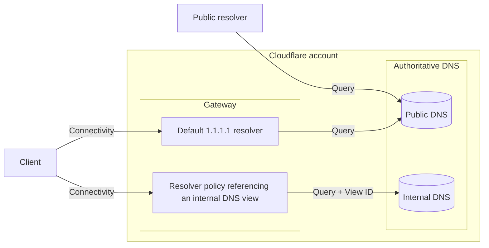

import { Render, Description, Plan, RelatedProduct, DirectoryListing } from "~/components";

<Description>
Simplify private network management with Cloudflare DNS for your internal resources.
</Description>

<Plan type="enterprise" />

Manage DNS records that should only be accessible within your private network. Internal DNS [zones](/dns/internal-dns/internal-zones/) and [views](/dns/internal-dns/dns-views/) pair up with [Gateway resolver policies](/cloudflare-one/policies/gateway/resolver-policies/) so that you can control how a DNS query should be responded according to context, such as its source IP.

:::note
Internal DNS is currently in closed beta. Using it on production traffic is at your own risk. If you are interested in this product, contact your account team.
:::

## Architecture overview

Internal DNS queries can only be resolved by using Cloudflare Gateway, which acts as an interface between the client and the internal zone.

Each DNS view is a logical grouping of internal DNS zones. Internal DNS zones can either contain the DNS records that should be used to resolve an internal DNS query or reference another internal zone that contains such record.

## Resources

<DirectoryListing />

## Related products

<RelatedProduct header="Gateway" href="/cloudflare-one/policies/gateway/" product="privacy-gateway">
Set up policies to inspect DNS, Network, HTTP, and Egress traffic.
</RelatedProduct>

<RelatedProduct header="Cloudflare Magic WAN" href="/magic-wan/" product="magic-wan">
Improve security and performance for your entire corporate networking, reducing cost and operation complexity.
</RelatedProduct>